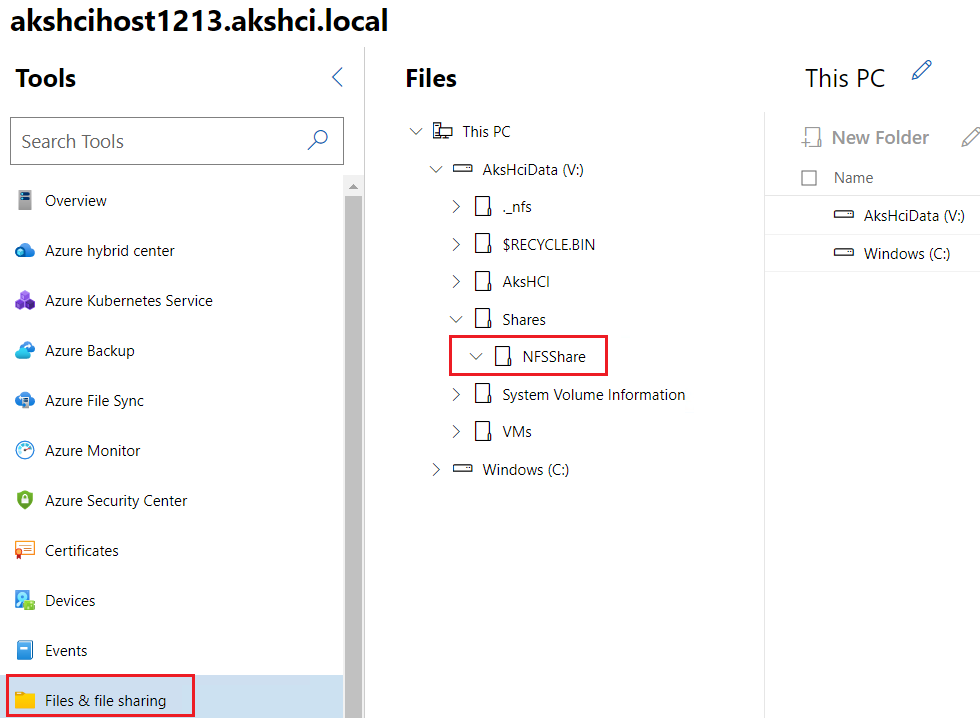
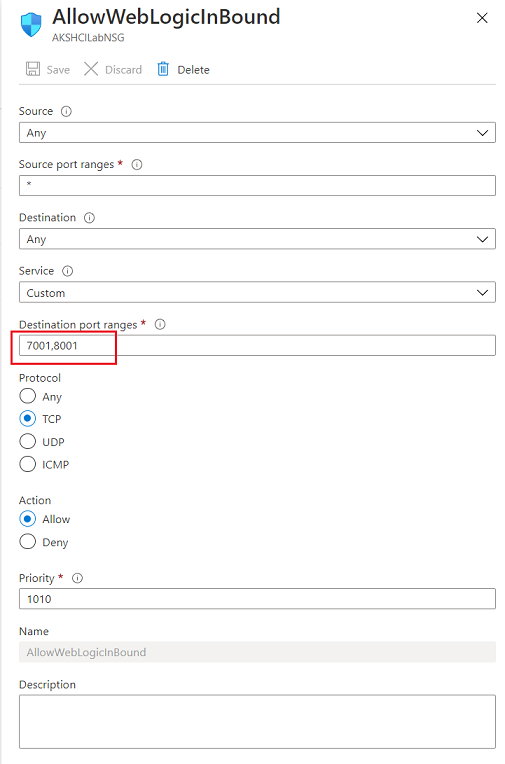
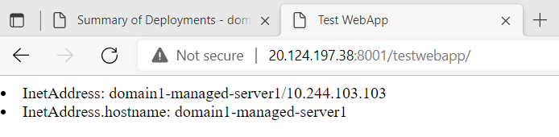

# Run Oracle WebLogic Server on HCI AKS cluster

## Overview

In this guide, you'll walk through the steps to run Oracle WebLogic Server on Azure Stack HCI AKS cluster. At a high level, this will consist of the following:

* Deploy Nested Virtualization Azure Stack HCI infrastructure, to act as your main Hyper-V host
* Deploy the AKS on Azure Stack HCI management cluster and target clusters for WebLogic workloads
* Deploy WebLogic servers on the AKS cluster with NFS share enabled - you can moderize WebLogic workload via domain on pv and model in image
* Expose WebLoigc Administration Console and applications deployed to WebLogic cluster.


## Contents

- [Overview](#overview)
- [Contents](#contents)
- [Architecture](#architecture)
- [Prerequisites](#prerequisites)
- [Set up AKS cluster on Azure Stack HCI](#set-up-aks-cluster-on-azure-stack-hci)
  - [Deploy Hyper-V host](#deploy-hyper-v-host)
  - [Set up Azure HCI AKS cluster](#set-up-azure-hci-aks-cluster)
  - [Connect to Azure Arc AKS](#connect-to-azure-arc-aks)
- [Deploy WebLoigc Server with domain on a PV](#deploy-webloigc-server-with-domain-on-a-pv)
  - [Enable NFS server for storage](#enable-nfs-server-for-storage)
  - [Create Persistent Volumn Claim](#create-persistent-volumn-claim)
  - [Install Oracle WebLogic Server Kubernetes Operator](#install-oracle-weblogic-server-kubernetes-operator)
  - [Deploy Weblogic cluster](#deploy-weblogic-cluster)
  - [Expose WebLogic cluster via Load Balancer](#expose-weblogic-cluster-via-load-balancer)
  - [Deploy application](#deploy-application)
- [Deploy WebLoigc Server with model in image]()
  - [Build WebLogic image and push to ACR]()
  - [Install Oracle WebLogic Server Kubernetes Operator]()
  - [Deploy Weblogic cluster]()
  - [Expose application via Ingress Controller]()
- [CI/CD consideration]()

## Architecture

WIP

## Prerequisites

- Azure Active Directory
  - Have a user with **Member** type. The user should be granted with **Application administrator**. The sample will use this user to connect to Azure from HCI.
  - If you are Microsoft employee, please do not use your MSFT account.

- Azure Subscription.
  - The user should have **Owner** role in the subscription. The user will assign a contributor role to an AAD application that Windows Admin Center creates.
 
## Set up AKS cluster on Azure Stack HCI

### Deploy Hyper-V host

Follow this [guide](https://github.com/Azure/aks-hci/blob/main/eval/steps/1_AKSHCI_Azure.md) to deploy your Hyper-V host. This guideline enables your to deploy the resources with two options:
  * [Use ARM template to deploy VM resources](https://github.com/Azure/aks-hci/blob/main/eval/steps/1_AKSHCI_Azure.md#option-1---creating-the-vm-with-an-azure-resource-manager-json-template)
  * [Use PowerShell](https://github.com/Azure/aks-hci/blob/main/eval/steps/1_AKSHCI_Azure.md#option-2---creating-the-azure-vm-with-powershell)

In this sample, we use ARM template to create the resources with default settings:


Access the VM machine using Window Remote Desktop.

In this example, login the machine with user `azureuser` and password that input in the ARM deployment.

### Set up Azure HCI AKS cluster

This sample will use Windows Admin Center to set up Azure connection and AKS cluster, if you prefer to use Powershell, please find steps in this [guide](https://github.com/Azure/aks-hci/blob/main/eval/steps/2b_DeployAKSHCI_PS.md)


Now you should be able to access the VM.

Before launching Windows Admin Center, we have to set trusted sites and allowed popups for browser.

1. [Make sure the default web browser is Edge browser](https://github.com/Azure/aks-hci/blob/main/eval/steps/2a_DeployAKSHCI_WAC.md#set-microsoft-edge-as-default-browser).
2. Set trusted sites. 

    To avoid connections issue in the following steps, we suggest you to enable the follow sites in trusted sites.

    Search for **Internet Options** in the Windows Start Menu, go to the **Security** tab, under the **Trusted Sites** option, click on the sites button and add the URLs in the dialog box that opens. Please add https://login.microsoftonline.com and https://login.live.com.

3. [Allow popups in Edge browser](https://github.com/Azure/aks-hci/blob/main/eval/steps/2a_DeployAKSHCI_WAC.md#allow-popups-in-edge-browser)
   
   Besides the gateway URL (link like https://akshcihost001), please also add https://login.microsoftonline.com and https://login.live.com.

4. [Connect to Azure](https://github.com/Azure/aks-hci/blob/main/eval/steps/2a_DeployAKSHCI_WAC.md#configure-windows-admin-center)

   Open Windows Admin Center and connect to Azure. As the user we are using has permission to create AAD app (it is **Application administrator** role in the tenant), we sugguest your to select **Create New** under **Connect to Azure Active Directory**.

5. Set up AKS cluster in CHI. Follow this [document](https://github.com/Azure/aks-hci/blob/main/eval/steps/2a_DeployAKSHCI_WAC.md#deploying-aks-on-azure-stack-hci-management-cluster) to set up AKS. Please stop before clicking **Apply**.

    After inputing the configurations, in the **Review** page, you should find settings like:

    

    Before clicking **Apply**, make sure the AAD application is authorized to call APIs when they are granted permissions by users/admins as part of the consent process. 
    
    Go to Azure portal, click **Azure Active Directory**, click your application name, e.g. `WindowsAdminCenter-https://akshcihost1213`, and click **API permissions**. You will find API status are not authorized.

    Click **Grant admin consent for your subscription** to authorize, find the following screenshot.
    

    After the deployment finished, the API permission status should be updated, like:
    

    Now you can lick **Apply** to apply the configuration and set up AKS cluster. It takes about 20min for the deployment. After the process finishes, you should find:

    

6. Create target cluster. Now you have set up management cluster in your HCI environment, but you still need to create AKS cluster for WebLogic.

    Follow step in [Create Target Cluster](https://github.com/Azure/aks-hci/blob/main/eval/steps/2a_DeployAKSHCI_WAC.md#create-a-kubernetes-cluster-target-cluster) to create an AKS cluster.

    This sample use the following settings:

    

    It takes about 20 min to set up target cluster.

### Connect to Azure Arc AKS

Now, you should have Azure Arc-enabled AKS cluster, you can managed the cluster outside the VM machine.

Let's have a look at the Arc AKS from Azure portal, your aks name should be `my-workload-cluster` if you didn't change the cluster name:


While when you click **Workloads**, you are asked to sign in to view your Kubernetets resources.

Document [Use Cluster Connect to connect to Azure Arc-enabled Kubernetes clusters](https://docs.microsoft.com/en-us/azure/azure-arc/kubernetes/cluster-connect#prerequisites) introduces two options to connect the cluster.

As we need admin role to create the WebLogic operator and deploy WebLogic cluster, this sample will guide you to connect to the cluster using service account token.

Open Windows Admin Center, click the server you are working on, here is `akshcihost1213.akshci.local`. Click **PowerShell** on the left, the Tools Navigation.

After the PowerShell console launches, you are connected to the machine successfully if you find text like:

```text
Connecting to akshcihost1213.akshci.local, Logon user AKSHCIHost1213\AzureUser
[akshcihost1213.akshci.local]: PS C:\Users\AzureUser\Documents>
```

Import HCI modules by running the following commands:

```powershell

Import-Module AksHci
Get-Command -Module AksHci
```

Query cluster information:

```powershell

Get-AksHciCluster
```

Output of this sample:

```text
Status                : {ProvisioningState, Details}
ProvisioningState     : Deployed
KubernetesVersion     : v1.21.2
PackageVersion        : v1.21.2-kvapkg.2
NodePools             : linuxnodepool
WindowsNodeCount      : 0
LinuxNodeCount        : 3
ControlPlaneNodeCount : 1
Name                  : my-workload-cluster
```

To retrieve the kubeconfig file for the cluster, you'll need to run the following command:

```powershell
Get-AksHciCredential -Name akshciclus001 -Confirm:$false
dir $env:USERPROFILE\.kube
```

Now, you can use `kubectl` to manage the cluster. The HCI Hyper-V host has installed `kubectl`, you can use it in the PowerShell console.

We need a service account to connect to the AKS cluster. Create a service account in any namespace and grant it with `cluster-admin` role, see this [document](https://kubernetes.io/docs/reference/access-authn-authz/rbac/#kubectl-create-rolebinding) for more information. Run the following command in the PowerShell console.

```powershell
kubectl create serviceaccount admin-user
kubectl create clusterrolebinding admin-user-binding --clusterrole cluster-admin --serviceaccount default:admin-user

$SECRET_NAME=$(kubectl get serviceaccount admin-user -o jsonpath='{$.secrets[0].name}')
$RAWTOKEN=$(kubectl get secret $SECRET_NAME -o jsonpath='{$.data.token}')
$TOKEN=[Text.Encoding]::Utf8.GetString([Convert]::FromBase64String($RAWTOKEN))

echo $TOKEN
```

Now you have to token to access the AKS cluster. Copy the token to a file, make sure the string is one line string, you may have to remove the new lines manually.

Open Azure Arc-enabled AKS cluster, input the token to sign in the cluster. 


You should be able to access the AKS resource from Azure portal.


With the token, we can manage the AKS cluster resource in the development machine, you are required to use a Linux machine, WSL in Windows machine, or Azure Cloud Shell.

This sample set up WebLogic cluster using WSL terminal from Windows 11 machine.

Run the shell commands to connect to AKS outside the HCI host.

Install `connectedk8s` extension and enable the Cluster Connect the Arc-enabled Kubernetes cluster.

```bash
# Install or upgrade Azure CLI to version >= 2.16.0 and <= 2.29.0
az extension add --name connectedk8s
az extension update --name connectedk8s
```

Connect to AKS cluster.

```bash
CLUSTER_NAME=<my-workload-cluster>
RESOURCE_GROUP=<resource-group-name>
$TOKEN=<the-token-from-above-powershell-command>

az connectedk8s proxy -n $CLUSTER_NAME -g $RESOURCE_GROUP --token $TOKEN
```

You will find output like:

```text
$ az connectedk8s proxy -n $CLUSTER_NAME -g $RESOURCE_GROUP --token $TOKEN
Proxy is listening on port 47011
Merged "my-workload-cluster" as current context in /home/bamboo/.kube/config
Start sending kubectl requests on 'my-workload-cluster' context using kubeconfig at /home/bamboo/.kube/config
Press Ctrl+C to close proxy.
```

Please do not close the proxy, we will deploy the WebLogic cluster in the next steps.

## Deploy WebLoigc Server with domain on a PV

Now the AKS cluster is ready to deploy WebLogic workloads. The previous steps have connected the AKS cluster in your local development machine, which has `git`, `helm`, `kubectl`, AZ CLI installed.

You are allowed to manage the AKS resources using `kubectl`.

Let's test by getting the namespace, you should find the following output:

```bash
$ kubectl get ns
NAME              STATUS   AGE
azure-arc         Active   103m
default           Active   113m
kube-node-lease   Active   113m
kube-public       Active   113m
kube-system       Active   113m
```

Before moving forward, we still have to create storage for the domain, as we will store the domain configuration to a PV.

### Enable NFS server for storage

This sample will enable the NFS server in the Hyper-V host, the Windows Server 2022 Azure VM. Follow this [guide](https://docs.microsoft.com/en-us/windows-server/storage/nfs/deploy-nfs) to eable NFS server and create NFS share.

This sample use Server Manager to create NFS share in the Azure VM. 

1. Connect to the Azure VM with user `azureuser`
2. Select Start, type servermanager.exe, and then select Server Manager.
3. In the Quick Start, click Add roles and features.
4. Installation Type: Role-based or feature-based installation.
5. Server Roles: File and Storage Service -> File and iSCSI SErvice -> check **Server for NFS**
6. Wait for the installation process finished.

Then create NFS share.

1. Open Server Manager again.
2. On the left, select File and Storage Services, and then select Shares.
3. Select To create a file share, start the New Share Wizard.
4. On the Select Profile page, select either NFS Share - Quick or NFS Share - Advanced, then select Next.
5. On the Share Location page, select a server and select **volume V**, and select Next.
6. On the Share Name page, specify a name for the new share, here is `NFSShare`, and select Next.
7. On the Authentication page, specify all the authentication method. Enable **Allow unmapped user access by UID/GID**
8. On the Share Permissions page, select **All Machines**, share permissions are **Read/Write**, and enable **Allow root access**.
9. In Permissions, configure the type of access control you want the users to have, and select OK.
10. On the Confirmation page, review your configuration, and select Create to create the NFS file share.


After the process finished, you should be able to find the file share from Windows Admin Center -> Files & file sharing.



Now, we can move on to create persistent volumn.


### Create Persistent Volumn Claim

This sample installs NFS server in the same machine of HCI infrastructure. The NFS server endpoint is `akshcihost1213.akshci.local`.

Before attaching pv to the AKS cluster, we have enable the CSI driver in the HCI AKS cluster, for more information, see this [document](https://docs.microsoft.com/en-us/azure-stack/aks-hci/container-storage-interface-files#use-nfs-drivers).

Now, you have to connect to the Hyper-V host, open the Azure VM using Remote Connect Desktop, with user `azureuser`.

Open PowerShell from Windows Admin Center, and run the following command:

```powsershell
Install-AksHciCsiNfs -clusterName my-workload-cluster
```

After the command finished, you should find csi-nfs pods are running in different nodes:

```powershell
kubectl get pod -n kube-system

NAME                                              READY   STATUS    RESTARTS   AGE
csi-nfs-controller-68b79c85c9-dtqjf               3/3     Running   0          56s
csi-nfs-node-g8d8s                                3/3     Running   0          56s
csi-nfs-node-h88xn                                3/3     Running   0          56s
csi-nfs-node-tm2v5                                3/3     Running   0          56s
... ...
```

Now let's switch to your development machine.

Create storage class for NFS share with the following configurations, make sure the server endpoint is matched with your NFS server. You can find the sample config from [nfs-storage-class.yaml](domain-on-pv/nfs-storage-class.yaml)

Pay attension to the following parameters:

| Name in YAML file | Example value | Notes |
|-------------------|---------------|-------|
| `parameters.server` | `akshcihost1213.akshci.local` | NFS Server endpoint. Make sure the NSF share is accessible externally. |
| `parameters.share`  | `/NFSShare` | You are able to find the share path from the NFS share properties. |

```YAML
apiVersion: storage.k8s.io/v1
kind: StorageClass
metadata:
  name: nfs-csi
provisioner: nfs.csi.akshci.com
parameters:
  server: akshcihost1213.akshci.local # NFS server endpoint
  share: /NFSShare # NFS share path
reclaimPolicy: Retain
volumeBindingMode: Immediate
mountOptions:
  - hard
  - nfsvers=4.1
```

Run the following command in your WSL terminal, we assume your haven't close the AKS connection proxy.

```bash
kubectl apply -f domain-on-pv/nfs-storage-class.yaml
```

Create persistent volumn claim using the following configurations. You can find the sample config from [nfs-csi-pvc.yaml](domain-on-pv/nfs-csi-pvc.yaml).
Make sure the `storageClassName` is matched with the storage class created in the last step.

```YALM
kind: PersistentVolumeClaim
apiVersion: v1
metadata:
  name: wls-on-aks-in-hci
  labels:
    weblogic.domainUID: domain1
spec:
  storageClassName: nfs-csi
  accessModes:
    - ReadWriteMany
  resources:
    requests:
      storage: 5Gi
```

```bash
kubectl apply -f domain-on-pv/nfs-csi-pvc.yaml
```

Validate the PVC, make sure the status is Bound!

```text
$ kubectl get pvc
NAME                STATUS   VOLUME                                     CAPACITY   ACCESS MODES   STORAGECLASS   AGE
wls-on-aks-in-hci   Bound    pvc-244d98f4-318d-4777-b22e-4e2733493d97   5Gi        RWX            nfs-csi        107s
```

Now, you are able to create your WebLogic cluster with domain on the PV.

### Install Oracle WebLogic Server Kubernetes Operator

Follow this [section](https://oracle.github.io/weblogic-kubernetes-operator/samples/azure-kubernetes-service/domain-on-pv/#install-weblogic-kubernetes-operator-into-the-aks-cluster) to install the operator.

Here lists the commands, run the command on your development machine, WSL terminal, assuming the terminal still connects to AKS cluster:

```bash
helm repo add weblogic-operator https://oracle.github.io/weblogic-kubernetes-operator/charts --force-update
helm install weblogic-operator weblogic-operator/weblogic-operator --version "3.3.4"
```

You should find the operator pod is running in default namespace.

```text
$ kubectl get pods
NAME                                              READY   STATUS      RESTARTS   AGE
weblogic-operator-56654bcdb7-qww7f                1/1     Running     0          25m
... ...
```

We will use sample scripts from [WebLogic Kubernetes Operator repository](https://github.com/oracle/weblogic-kubernetes-operator) to create WebLogic cluster, please clone the repository before going on.

```bash
git clone --branch v3.3.6 https://github.com/oracle/weblogic-kubernetes-operator.git

```

### Deploy WebLogic cluster

With the WebLogic operator running, you are able to deply the WebLogic domain following steps in [Create WebLogic domain](https://oracle.github.io/weblogic-kubernetes-operator/samples/azure-kubernetes-service/domain-on-pv/#create-weblogic-domain).

Here lists the commands:

1. Create WebLogic account secret and Oracle SSO account secret.

    ```bash
    #create weblogic account secret, user name is weblogic, password is welcome1
    cd kubernetes/samples/scripts/create-weblogic-domain-credentials
    ./create-weblogic-credentials.sh -u weblogic -p welcome1 -d domain1

    #create Oracle SSO account secret.
    export SECRET_NAME_DOCKER="wlsregcred"
    cd kubernetes/samples/scripts/create-kubernetes-secrets
    ./create-docker-credentials-secret.sh -s ${SECRET_NAME_DOCKER} -e oracleSsoEmail@bar.com -p oracleSsoPassword -u oracleSsoEmail@bar.com
    ```

2. Create WebLogic domain

    This sample uses [domain1.yaml](domain-on-pv/domain1.yaml) to deploy the WebLogic cluster.

    ```bash
    cd kubernetes/samples/scripts/create-weblogic-domain/domain-home-on-pv
    ./create-domain.sh -i <path-to-domain1.yaml> -o ~/azure -e -v
    ```
    
    If the script is running correctly, you should find output like:

    ```text
    createDomainScriptName is create-domain-job.sh
    Generating /home/bamboo/azure/weblogic-domains/domain1/create-domain-job.yaml
    Generating /home/bamboo/azure/weblogic-domains/domain1/delete-domain-job.yaml
    Generating /home/bamboo/azure/weblogic-domains/domain1/domain.yaml
    Checking to see if the secret domain1-weblogic-credentials exists in namespace default
    Checking if the persistent volume claim wls-on-aks-in-hci in NameSpace default exists
    The persistent volume claim wls-on-aks-in-hci already exists in NameSpace default
    W1213 18:25:50.628454    6179 helpers.go:557] --dry-run is deprecated and can be replaced with --dry-run=client.
    configmap/domain1-create-weblogic-sample-domain-job-cm configured
    Checking the configmap domain1-create-weblogic-sample-domain-job-cm was created
    'weblogic.domainUID' already has a value (domain1), and --overwrite is false
    'weblogic.domainName' already has a value (domain1), and --overwrite is false
    Checking if object type job with name domain1-create-weblogic-sample-domain-job exists
    Deleting domain1-create-weblogic-sample-domain-job using /home/bamboo/azure/weblogic-domains/domain1/create-domain-job.yaml
    job.batch "domain1-create-weblogic-sample-domain-job" deleted
    Creating the domain by creating the job /home/bamboo/azure/weblogic-domains/domain1/create-domain-job.yaml
    job.batch/domain1-create-weblogic-sample-domain-job created
    Waiting for the job to complete...
    status on iteration 1 of 30
    pod domain1-create-weblogic-sample-domain-job-zmbp5 status is Completed
    domain.weblogic.oracle/domain1 created

    Domain domain1 was created and will be started by the WebLogic Kubernetes Operator

    Administration console access is available at http://127.0.0.1:30701/console
    The following files were generated:
      /home/bamboo/azure/weblogic-domains/domain1/create-domain-inputs.yaml
      /home/bamboo/azure/weblogic-domains/domain1/create-domain-job.yaml
      /home/bamboo/azure/weblogic-domains/domain1/domain.yaml

    Completed
    ```

    But now, you can not access the WebLogic Console as the admin server is not ready.
    It takes about 5min for the whole cluster is ready.

    You should find the WebLogic pods status like:

    ```text
    $ kubectl get pod -w
    NAME                                              READY   STATUS      RESTARTS   AGE
    domain1-create-weblogic-sample-domain-job-zmbp5   0/1     Completed   0          50s
    domain1-introspector-cnb4s                        1/1     Running     0          14s
    weblogic-operator-7c6889968f-bnth5                1/1     Running     0          117s
    domain1-introspector-cnb4s                        0/1     Completed   0          21s
    domain1-introspector-cnb4s                        0/1     Terminating   0          22s
    domain1-introspector-cnb4s                        0/1     Terminating   0          22s
    domain1-admin-server                              0/1     Pending       0          0s
    domain1-admin-server                              0/1     Pending       0          0s
    domain1-admin-server                              0/1     ContainerCreating   0          0s
    domain1-admin-server                              0/1     ContainerCreating   0          1s
    domain1-admin-server                              0/1     Running             0          1s
    domain1-admin-server                              1/1     Running             0          77s
    domain1-managed-server1                           0/1     Pending             0          0s
    domain1-managed-server1                           0/1     Pending             0          0s
    domain1-managed-server1                           0/1     ContainerCreating   0          0s
    domain1-managed-server1                           0/1     ContainerCreating   0          2s
    domain1-managed-server1                           0/1     Running             0          53s
    domain1-managed-server1                           1/1     Running             0          53s
    ```

Now, you have a running WebLogic cluster with no application deployed. You can deploy application through WebLogic Administration Console. 
While, currently, no one can access the WebLogic Administration Console outside the AKS cluster, we have to expose it first!

### Expose WebLogic cluster via Load Balancer

This sample will expose the Administration Server and the cluster with Azure Load Balancer services.

You can create the Azure Load Balancer service to expose the Administration Server using configuration provided in [lb-admin.yaml](domain-on-pv/lb-admin.yaml), with the following content:

```YAML
apiVersion: v1
kind: Service
metadata:
  name: domain1-admin-server-external-lb
  namespace: default
spec:
  ports:
  - name: default
    port: 7001
    protocol: TCP
    targetPort: 7001
  selector:
    weblogic.domainUID: domain1
    weblogic.serverName: admin-server
  sessionAffinity: None
  type: LoadBalancer
```

Run the follwowing command to apply the config.

```bash
kubectl apply -f domain-on-pv/lb-admin.yaml
```

You can create the Azure Load Balancer service to expose the cluster using configuration provided in [lb-admin.yaml](domain-on-pv/lb-cluster.yaml), with the following content:

```YAML
apiVersion: v1
kind: Service
metadata:
  name: domain1-cluster-1-external-lb
  namespace: default
spec:
  ports:
  - name: default
    port: 8001
    protocol: TCP
    targetPort: 8001
  selector:
    weblogic.domainUID: domain1
    weblogic.clusterName: cluster-1
  sessionAffinity: None
  type: LoadBalancer
```

Run the following command to apply the config.

```bash
kubectl apply -f domain-on-pv/lb-cluster.yaml
```

You can check the service with `kubectl get svc` command:

```text
$ kubectl get svc
NAME                               TYPE           CLUSTER-IP       EXTERNAL-IP     PORT(S)              AGE
domain1-admin-server-external-lb   LoadBalancer   10.109.109.255   192.168.0.152   7001:32039/TCP       87s
domain1-cluster-1-external-lb      LoadBalancer   10.106.141.145   192.168.0.153   8001:30754/TCP       4s
... ...
```

Now you should be able to access the Administration Server from the HCI host. Open the Edge browser in your HCI machine, enter `http://<admin-server-external-ip>:7001/console`, here is `http://192.168.0.152:7001/console`, you shoule be able to open the login page.


But, you cannot access the URL outside the HCI machine. We have to expose the Administration Server to the internet with extra steps.

1. Add an inbould role to the network security group. 

  Follow this [guidance](https://github.com/Azure/aks-hci/blob/main/eval/steps/3_ExploreAKSHCI.md#add-an-inbound-rule-to-your-nsg) to add the inbound port rule. For WebLogic Server in this sample, we have to allow traffic to the Administration Server via port `7001` and to the cluster via port `8001`.

  Here shows the NSG rule for this sample:

  

2. Add new NAT Static Mapping

  We have to NAT the incoming traffic through to the containerized application.

  Please go back to the Windows Admin Center, and open Powershell, run the following commands to create new Static NAT Mapping.

  For Oracle WebLogic Server Administration Server, the value of `InternalIPAddress` should be the `EXTERNAL-IP` of `domain1-admin-server-external-lb` servive, listed above.

  ```powershell
  Add-NetNatStaticMapping -NatName "AKSHCINAT" -Protocol TCP -ExternalIPAddress '0.0.0.0/24' -ExternalPort 7001 `
      -InternalIPAddress '192.168.0.152' -InternalPort 7001
  ```

  You will get output like:

  ```text
  StaticMappingID               : 0
  NatName                       : AKSHCINAT
  Protocol                      : TCP
  RemoteExternalIPAddressPrefix : 0.0.0.0/0
  ExternalIPAddress             : 0.0.0.0
  ExternalPort                  : 7001
  InternalIPAddress             : 192.168.0.152
  InternalPort                  : 7001
  InternalRoutingDomainId       : {00000000-0000-0000-0000-000000000000}
  Active                        : True
  ```

  For Oracle WebLogic Server cluster, the value of `InternalIPAddress` should be the `EXTERNAL-IP` of `domain1-cluster-1-external-lb` servive, listed above.

  ```powershell
  Add-NetNatStaticMapping -NatName "AKSHCINAT" -Protocol TCP -ExternalIPAddress '0.0.0.0/24' -ExternalPort 8001 `
      -InternalIPAddress '192.168.0.153' -InternalPort 8001
  ```

  Now, you are able to access the Administration Server with address `http://<hci-vm-public-ip>:7001/console`, you can find the public IP address of the Azure VM with steps:

  * Open the resource group that deployed in [Deploy Hyper-V host](#deploy-hyper-v-host).
  * Open the Virtual Machine resource, you should find the Public IP address in the **Overview** page.

  Now access the the Administration Server outside the VM.

  

### Deploy application

Now you are able to deploy a Java EE application following steps in [Deploy sample application](https://oracle.github.io/weblogic-kubernetes-operator/samples/azure-kubernetes-service/domain-on-pv/#deploy-sample-application).

After the application is active, you can access it with address `http://<hci-vm-public-ip>:8001/<your-app>`, address of this sample is `http://20.124.197.38:8001/testwebapp`



You can access WebLogic Server log from the NFS share. 


